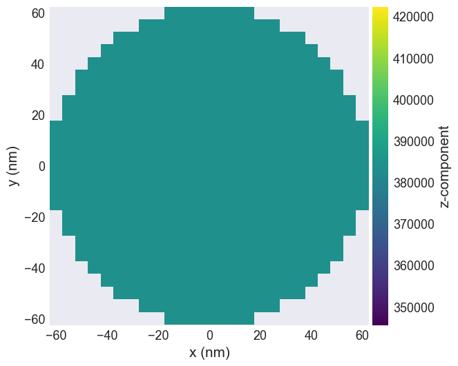
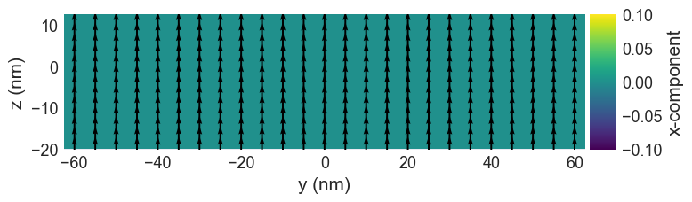
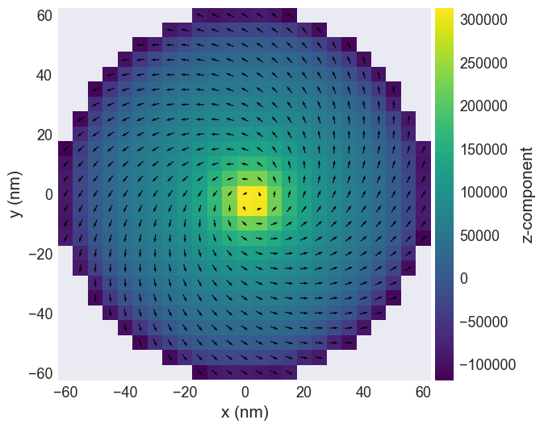
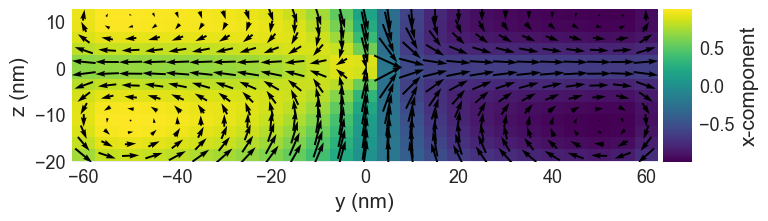

# McPy - A Micromagnetic Monte Carlo Simulation package

## Overview
McPy is a specialized package designed for conducting Monte Carlo (Metropolis-Hastings) simulations in micromagnetics for studying magnetic quasiparticles. This has been developed as part of my Master's thesis to study the thermal stability of Bloch Points, a magnetic quasiparticle pivotal for modern data storage solutions. The package has been developed to allow non-zero temperature simulations in micromagnetics using Metropolis-Hastings.

## Integration with Ubermag
McPy seamlessly integrates as an extension of [Ubermag](https://ubermag.github.io/index.html), an established micromagnetic simulation framework. Ubermag encompasses a suite of independent Python packages suitable for diverse physics simulations, including Computational Fluid Dynamics. While Ubermag already contains well-maintained energy minimisation solvers, the goal of McPy is to extend the capabilities of Ubermag by adding a non-perturbative approach to energy minimisation that has not been implemented till now.

## Key Features

- **Developed in Python:** Simulation conditions can be easily modified and run using Jupyter Notebook.
- **Numba Accelerated:** Utilizes the Numba "Just-in-time" compiler for performance comparable to C.
- **3D Finite Difference Micromagnetic Model:** Enables continuous magnetization.
- **Comprehensive Energy Calculations:** Supports:
  - Zeeman energy
  - Uniaxial anisotropy energy
  - Exchange energy
  - Dzyaloshinskii-Moriya (DMI) energy


### Why Monte Carlo in micromagnetics?

Here are several papers validating the effectiveness of Monte Carlo in this field
 - [Simulating anti-skyrmions on a lattice](https://www.nature.com/articles/s41598-022-22043-0)
 - [The skyrmion lattice phase in three-dimensional chiral magnets from Monte Carlo simulations](https://arxiv.org/abs/1304.6580)


## Installation:

### Requirements
        - Python==3.10.11
        - Ubermag with default oommfc driver: Follow the installation guide at [Ubermag Installation](https://ubermag.github.io/installation.html)
        - NumPy==1.24.3
        - Numba==0.57.0
        - cupy-cuda12x==12.1.0

Installation of the above packages can be achieved by running the following command

```bash 

conda env create -f environment.yml

```

## Usage:

#### Visualising a magnetic singularity - Bloch Point

The following example is from [Stable and Manuplable Bloch Point](https://www.nature.com/articles/s41598-019-44462-2). This paper produced results using the Landau–Lifshitz–Gilbert (LLG) equation at absolute zero using a finite element solver. However, we will recreate the results using finite difference Monte Carlo at elevated temperatures.

1. Importing Packages

```python
import discretisedfield as df
import micromagneticmodel as mm
import oommfc as oc
from mcpy.system import MCDriver

```

2. Defining the System parameters
```python
# Magnetisation
Ms = 3.84e5

# Exchange energy constant
A = 8.78e-12

# System geometry
d = 125e-9
hb = 20e-9
ht = 12.5e-9

# Cell discretisation
cell = (5e-9, 5e-9, 2.5e-9)

# Bilayer disk
D_bloch = {'r1': -1.58e-3, 'r2': 1.58e-3, "r1:r2": 1.58e-9}

subregions = {'r1': df.Region(p1=(-d/2, -d/2, -hb), p2=(d/2, d/2, 0)), 'r2': df.Region(p1=(-d/2, -d/2, 0), p2=(d/2, d/2, ht))}

p1 = (-d/2, -d/2, -hb)
p2 = (d/2, d/2, ht)
```
3. Creating Mesh and assigning Energy terms
```python
# Creating mesh
mesh = df.Mesh(p1=p1, p2=p2, cell=cell, subregions=subregions)

def Ms_fun(point):
        x, y, z = point
        if x**2 + y**2 < (d/2)**2:
                return Ms
        else:
                return 0

system = mm.System(name='bloch_point')

system.energy = mm.Exchange(A=A) + mm.DMI(D=D_bloch, crystalclass='T')
system.m = df.Field(mesh, dim=3, value=(0, 0, 1), norm=Ms_fun)

```

4. Visualising the system

```python
system.m.plane('z').mpl()
system.m.plane('x').mpl()
```



5. Monte Carlo Simulation

```python

# Optinal argument for annealing schedule
schedule = schedule={'type': 'FC', 'start_temp': 60, 'end_temp': 0.001, 'steps': 20}

# Defining Monte Carlo driver object
mc = MCDriver(system, schedule_name='bloch_point', schedule=schedule)

# 10 million Monte Carlo iterations
mc.drive(N=10000000)

# Visualising the Bloch Point

system.m.plane('z').mpl()
system.m.plane('x').mpl()

# We can observe a "Head-to-Head" Bloch point at the middle of the disk 

```




## Tests:
To run the automated tests

```bash

python -m unittest tests.py

```

## Repository structure
- `mcpy`: The folder containing the main package
    - `system.py`: MCDriver and Grid classes to initial the Monte Carlo driver object and Grid object
    - `driver.py`: Python function to run the Monte Carlo simulations
    - `energies`
        - `numpy_energies.py`: Numpy optimised energy calculations
        - `numba_energies.py`: Numba optimised energy calculations
- `tests.py`: Unittests
- `Notebooks`: 
     - `Instructios.ipynb`: Instructions on how to use the module
     - `Curie_temperature.ipynb`: Curie temperature calculations
     - `bloch_point.ipynb`: Bloch point simulation
   

## Documentation
You can find the documentation at `docs/html/index.html`. 

## Outcomes

The full outcomes and analysis can be found in the 
final report of this project in `reports`.

## License:
The scripts and documentation in this project are released under 
the [MIT License](https://github.com/actions/upload-artifact/blob/main/LICENSE)


